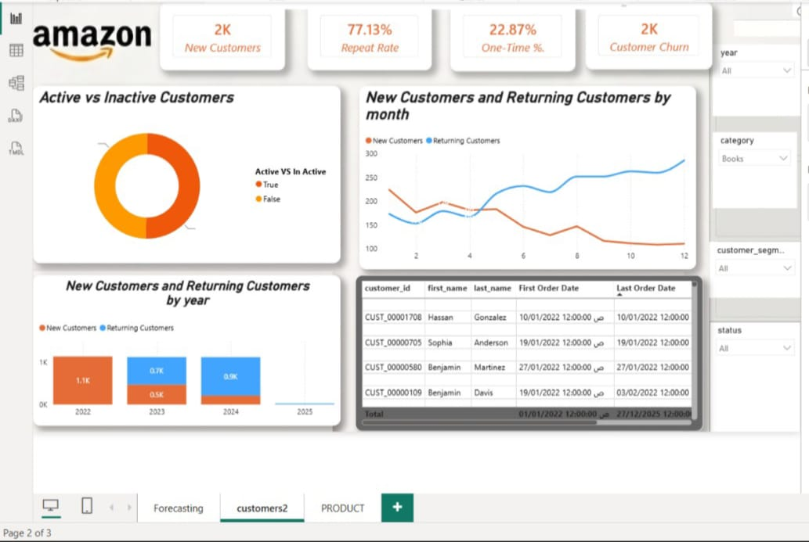

# 🌐 Amazon & Customer Analytics Intelligence Dashboard

<div align="center">

[]()
[]()
[]()
[]()

</div>

---

## 📌 Executive Summary
An end-to-end Business Intelligence solution engineered to analyze customer behavior, retention, and churn metrics for Amazon-based operations. This dashboard transforms raw customer data into actionable insights, driving engagement strategies and loyalty optimization.

---

## 🛑 The Business Challenge
Global leadership faced critical operational bottlenecks:
* **Customer Retention Tracking:** Difficulty in monitoring repeat customer rates (`77.13%`) versus one-time buyers (`22.87%`) over time.
* **Churn Visibility:** Inability to track customer churn patterns (`2K Churn`) across various product categories and geographic segments efficiently.
* **Segmentation Gaps:** Lack of granular insights into new customer acquisition trends versus returning buyers on a monthly and yearly basis.

---

## 💡 The Data-Driven Solution
Designed and deployed a fully interactive, enterprise-grade Power BI dashboard featuring:
* **Customer Lifetime Tracking:** Centralized metrics to monitor active vs. inactive customer statuses and overall database growth.
* **Advanced Cross-Filtering:** Enabled dynamic slicing by years, categories, customer segments, and order dates to drill down into purchasing behaviors.
* **Retention Optimization:** Provided clear visual breakdowns of repeat purchase rates to help stakeholders design targeted loyalty programs.

---

## 🛠️ Key Performance Indicators (KPIs) & Architecture
The dashboard tracks core customer and behavioral metrics built via robust data modeling and advanced DAX measures:

| Metric | Value | Business Impact |
| :--- | :---: | :--- |
| **New Customers** | **2K** | Measures recent customer acquisition expansion over the active timeline[cite: 8]. |
| **Repeat Rate** | **77.13%** | Evaluates customer loyalty and brand retention effectiveness[cite: 8]. |
| **One-Time %** | **22.87%** | Tracks the proportion of single-purchase buyers needing conversion[cite: 8]. |
| **Customer Churn** | **2K** | Monitors inactive user volume and highlights retention risks[cite: 8]. |

---

## 📸 Dashboard Preview



---

## 🚀 Technical Highlights & Skills Demonstrated
- **Data Modeling & Architecture:** Built a clean relational model ensuring optimal filter propagation and high query performance for customer transactions.
- **Advanced DAX Formulas:** Developed custom measures for churn calculation, repeat rates, and dynamic cohort analysis.
- **UI/UX Design for Executives:** Applied modern corporate design principles (clean alignment, intentional color grading, zero visual clutter) tailored for stakeholder presentations.

---

## 📁 Repository Structure
```text
├── dashboard_preview.jpg.jpeg            # Visual preview of the dashboard interface
└── Enterprise-Revenue-Dashboard.pbix     # Source Power BI file containing data models & DAX
